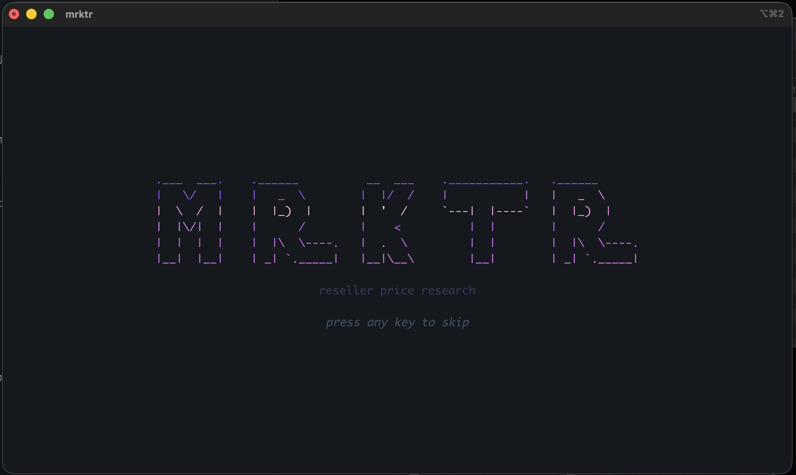

# mrktr

A terminal-based reseller price research tool for comparing marketplace prices.


## Preview



## Features

- **Multi-Marketplace Search** - Compare prices across eBay, Mercari, Amazon, and Facebook Marketplace
- **Brave-First Search Pipeline** - Uses Brave Search as primary provider with Tavily fallback
- **Conservative Query Expansion** - TF-IDF product matching expands vague queries when confidence is high
- **Inline Predictive Suggestions** - Ghost text suggestions from search history + product catalog
- **Real-Time Statistics** - Instantly see min, max, average, and median prices
- **Profit Calculator** - Enter your cost and see potential profit margins
- **Search History** - Quick access to recent searches
- **Vim-Style Navigation** - Navigate with j/k keys or arrow keys
- **Clean Dashboard UI** - Professional panel-based interface

## Installation

### Prerequisites

- Go 1.21 or higher

### Build from Source

```bash
# Clone the repository
git clone https://github.com/yourusername/mrktr.git
cd mrktr

# Build the binary
go build -o mrktr .

# Run
./mrktr
```

### Install to PATH

```bash
# After building, copy to your PATH
sudo cp mrktr /usr/local/bin/

# Now run from anywhere
mrktr
```

## Configuration

mrktr uses live search APIs. Configure at least one provider key as an environment variable:

```bash
BRAVE_API_KEY
TAVILY_API_KEY
FIRECRAWL_API_KEY
```

`mrktr` automatically loads a local `.env` file from the `mrktr/` working directory at startup.

## Usage

### Basic Workflow

1. **Launch the app**
   ```bash
   mrktr
   ```

2. **Search for an item**
   - Type your search query (e.g., "iPhone 14 Pro")
   - Press `Tab` to accept inline suggestion text
   - Press `Enter` to search

3. **Review results**
   - Use `j/k` or arrow keys to navigate results
   - View statistics in the right panel

4. **Calculate profit**
   - Press `c` to focus the calculator
   - Enter your cost
   - See profit margins at different price points

5. **Open listing**
   - Press `Enter` on a result to open the URL in your browser

## Keybindings

| Key | Action |
|-----|--------|
| `/` | Focus search input |
| `Enter` | Execute search / Open selected URL |
| `Tab` | Accept search suggestion / Cycle panels |
| `Shift+Tab` | Cycle panels backwards |
| `j` / `Down` | Move down in list |
| `k` / `Up` | Move up in list |
| `c` | Focus profit calculator |
| `Esc` | Unfocus current panel |
| `q` | Quit application |
| `Ctrl+C` | Force quit |

## Project Structure

```
mrktr/
├── main.go          # Entry point, program initialization
├── model.go         # Application state and data structures
├── update.go        # Keyboard handling and state updates
├── view.go          # UI rendering logic
├── styles.go        # Lip Gloss styles and colors
├── api/             # Search providers, parsing, query suggestions
│   ├── search.go
│   ├── brave.go
│   ├── tavily.go
│   ├── firecrawl.go
│   └── suggest.go
├── types/           # Listing and statistics types
│   └── listing.go
├── go.mod           # Go module definition
└── README.md        # This file
```

## Tech Stack

- **Language:** [Go](https://golang.org/)
- **TUI Framework:** [Bubble Tea](https://github.com/charmbracelet/bubbletea)
- **Styling:** [Lip Gloss](https://github.com/charmbracelet/lipgloss)
- **Components:** [Bubbles](https://github.com/charmbracelet/bubbles)
- **Search APIs:** Brave Search API, Tavily, Firecrawl (rollback fallback)

## How It Works

1. **Search Query** - User enters an item name
2. **Query Enhancement** - Short ambiguous queries are expanded via local TF-IDF product index
3. **API Request** - Query is sent to Brave/Tavily/Firecrawl with marketplace site filters
4. **Price Parsing** - Regex extracts prices from search results
5. **Platform Detection** - URLs are parsed to identify the marketplace
6. **Statistics** - Min, max, average, and median are calculated
7. **Display** - Results are rendered in the dashboard

## Contributing

Contributions are welcome! Here's how to get started:

1. Fork the repository
2. Create a feature branch (`git checkout -b feature/amazing-feature`)
3. Commit your changes (`git commit -m 'Add amazing feature'`)
4. Push to the branch (`git push origin feature/amazing-feature`)
5. Open a Pull Request

### Development

```bash
# Run with live reload (requires air)
air

# Or run directly
go run .

# If your environment blocks the default Go cache location
GOCACHE=$(pwd)/.cache/go-build GOMODCACHE=$(pwd)/.cache/go-mod go test ./...
```

## License

MIT License - see [LICENSE](LICENSE) for details.

---

Built with [Bubble Tea](https://github.com/charmbracelet/bubbletea)
